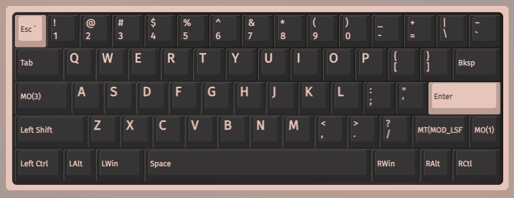
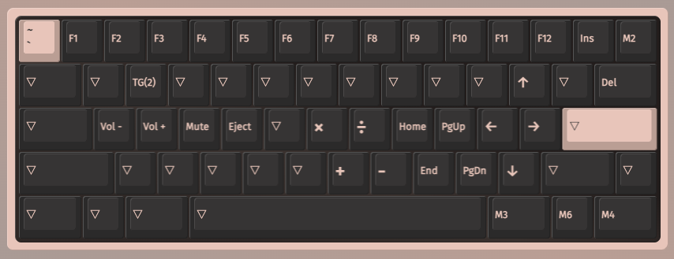
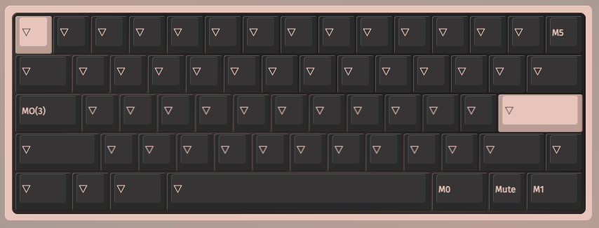
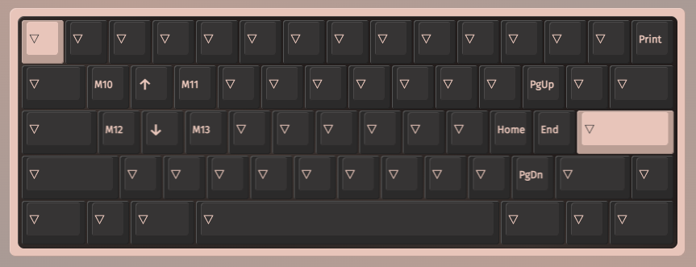
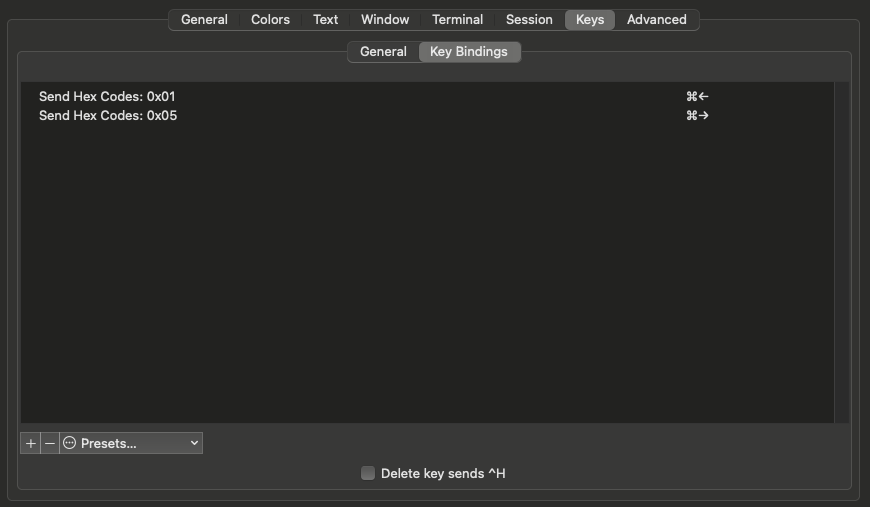

# Hibi June 60% VIA keymap 

## ABOUT  
The keymap mostly follows the ANSI HHKB keymap.  
The board uses 1u keys in Row 3 (ESC, 1-0, -, =, \, `)  
Backspace is on row 3, above enter.  
7u spacebar with three mod keys on each side. (ctl, alt, cmd, space, cmd, alt, ctl) 

## LAYERS  
  
0 - Default, keys generally do what they say, uses macros that target MacOS   

  
1 - Main fn layer, numbers become fkeys, right mods switch desktops.  

  
2 - Changes some of the macros from L1 to Windows equivilents.  

  
3 - Second fn layer (activiated w caps lock key) meta-navigation, WASD cluster becomes home/end, line up/down, to speed up navigating text.   

## MACROS   
M00 - previous display (win) - cmd+ctl+left  
M01 - next display (win) - cmd+ctl+left   
M02 - mute zoom (mac) - cmd+shift+a  
M03 - previous display (mac) - ctl+left   
M04 - next display (mac) - ctl+right  
M05 - screenshot (win) - cmd+printscreen  
M06 - screenshot (mac)  - cmd+shift+4  
M07 - not used  
M08 - not used  
M09 - not used  
M10 - back-browser chrome (mac)  - cmd+[   
M11 - forward-browser chrome (mac) - cmd+]   
M12 - begining of line (mac) - cmd+left  
M13 - end of line (mac) - cmd+right  
M14 - not used  
M15 - not used  

## QUIRKS 
Right shift: Hold for shift, tap to delete.  
Esc: cmd+esc = cmd+` - "grave escape" - to support tabbing thru open application windows.  
Fn+w: Toggles windows layer (layer 2).  
Caps Lock: Hold to access the navigation layer (layer 3).

## Notes

### iTerm
The combo cmd+left | right, which are the mac shortcut to move to the start or end of a line, are used by the program to move between tabs, and don't work by default.  

The standard home/end keys do work as expected in this case, but not everywhere on macOS responds consistantly to them, which is why layer three uses the mac shortcuts.  

  
One solution for iterm is to map the shortcut in the iterm settings>profile>keys>key bindings. It will compain about a conflict (because the program uses the shortcut for tabs), but you can override the default behavior if you don't need it, and the left hand navigation keys will work as expected. 